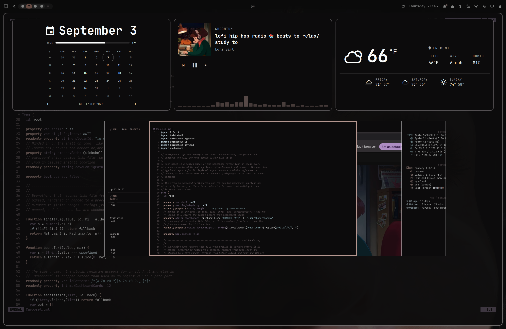

# Omadeck Super+TAB

Fork of [Omadeck](https://github.com/iryzhkov/omarchy-omadeck) tuned to live on
`SUPER + TAB`. Same full-screen overview — a row of live plugin panels above a
fanned deck of live workspace previews — but with a flat list of windows instead
of the stock per-workspace stack, exclusive keyboard focus while up, and key
handling for `Tab` / `Shift+Tab` / `Enter` to drive selection without leaving
the overlay.



## What this fork changes

- **Flat window list.** The deck shows every toplevel on the focused monitor
  as one row of panels instead of grouping them per workspace. Empty workspaces
  drop out of the stack automatically because there is nothing to show for them.
- **Exclusive keyboard focus.** The overlay grabs keys while open, so `Tab` and
  `Shift+Tab` cycle the selection and `Enter` commits it without falling through
  to whatever widget had focus before.
- **`SUPER + TAB` is the default summon key.** Picked to leave `ALT + TAB` on
  Hyprland's native window switcher, which is what most window managers and
  desktop environments use it for.

Everything else — live previews via `hyprland-toplevel-export`, the themed fan
chrome, the dashboard row of embedded plugin panels, the media card with the
cava spectrum, the "follow the focused workspace" behaviour — comes from
upstream unchanged.

## Install

```
omarchy plugin add https://github.com/camilo211g/omadeck-super-tab.git --enable
```

Then bind a key in `~/.config/hypr/bindings.lua`:

```lua
o.bind("SUPER + TAB", "Omadeck Super+TAB", "omarchy-shell shell toggle io.github.camilo211g.omadeck-super-tab")
```

For the dashboard row above the deck, add a `dashboard` entry to the plugin in
`~/.config/omarchy/shell.json`:

```json
{
  "id": "io.github.camilo211g.omadeck-super-tab",
  "dashboard": ["omarchy.clock", "media", "omarchy.weather"]
}
```

Plugin ids are listed in order. `media` is the one entry that is not a plugin
id: it is this plugin's own media card, because Omarchy ships an MPRIS service
and a bar pill but no media panel to embed. An empty array turns the row off.

## Requirements

- Hyprland with `hyprland-toplevel-export` (Omarchy ships it).
- `cava` is optional — without it the spectrum under the media card is empty
  and nothing else changes.

## Credits

Fork of [iryzhkov/omarchy-omadeck](https://github.com/iryzhkov/omarchy-omadeck)
by Igor Ryzhkov, MIT licensed. This fork carries the same license; see
[LICENSE](LICENSE).