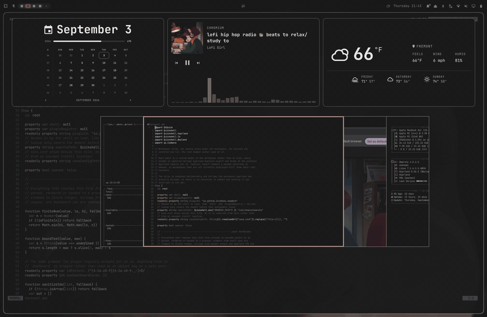

# Omadeck

A full-screen overview for Omarchy: a row of live plugin panels above a fanned
deck of live workspace previews. Summon it on a key of your choosing, then move
between workspaces however you normally do. The deck follows along and shows
you what is on each one.


## What it does

- **Live workspace previews.** Every panel is a scaled model of the workspace,
  not an icon. Each window is captured through `hyprland-toplevel-export` and
  drawn at the position Hyprland reports for it, so workspaces that are not on
  screen still show their real contents.
- **A fan, seen head-on.** The focused workspace is the top layer, lit and
  outlined in the theme accent. The rest sit behind it and peek out to either
  side, dimming further back. Every panel is the same size at the same height,
  so the stack slides under the selection and nothing bobs, grows or shrinks.
- **Takes no keys of its own.** One binding summons it. `SUPER + TAB`,
  `SUPER + 1..9`, a click in the bar, and a window pulling you to another
  workspace all keep working exactly as before, and the deck mirrors whatever
  Hyprland focuses while it is up.
- **A dashboard of real panels.** The row above the deck embeds other plugins'
  own detail panels, live: the same weather, calendar, network or audio card
  you get from the bar, running with its own data. Any installed plugin with a
  panel works, third-party ones included.
- **A media card with a spectrum.** Artwork, player, title, artist, progress
  and prev / play-pause / next through Omarchy's own MPRIS service, with a live
  spectrum from [cava](https://github.com/karlstav/cava) underneath when it is
  installed.
- **Empty workspaces are left out**, matching what `workspace e+1` does for the
  stock `SUPER + TAB`. The workspace you are on is always included.



## Install

```
omarchy plugin add https://github.com/iryzhkov/omarchy-omadeck.git --enable
```

Then bind a key to summon it, in `~/.config/hypr/bindings.lua`:

```lua
o.bind("SUPER + Multi_key", "Omadeck", "omarchy-shell shell toggle io.github.iryzhkov.omadeck")
```

`Multi_key` is Caps Lock: Omarchy sets `compose:caps` in its keyboard options,
so the physical Caps Lock key emits the compose keysym and that is the name a
binding has to use. Any other chord works just as well.

The deck stays up until you dismiss it: press the same key again, click the
focused panel, or click the backdrop. Clicking a panel that is not focused
switches to that workspace. Set `dwellMs` (below) to have it hide itself after
that many idle milliseconds instead.

### Optional: cava

The spectrum in the media card comes from cava. Without it the card loses the
bars and nothing else changes.

```
omarchy pkg add cava
```

## Dashboard

The row above the deck is configured on this plugin's entry in
`~/.config/omarchy/shell.json`. The default is the row in the screenshot above:
the clock's calendar panel, the media card, and the weather panel.

```json
{
  "id": "io.github.iryzhkov.omadeck",
  "dashboard": ["omarchy.clock", "media", "omarchy.weather"]
}
```

To embed the network and audio panels instead, for example:

```json
{
  "id": "io.github.iryzhkov.omadeck",
  "dashboard": ["omarchy.network", "media", "omarchy.audio"]
}
```

`dashboard` lists plugin ids, in order. `media` is the one entry that is not a
plugin id: it is this plugin's own media card, because Omarchy ships an MPRIS
service and a bar pill but no media panel to embed. An empty array turns the
row off.

Every card in the row is the same size (`panelWidth` x `panelHeight`), and a
panel that wants more room than that is scaled down to fit rather than clipped
or scrolled. A panel that turns out not to be embeddable is dropped from the
row rather than left as an empty card.

`dashboardMode` picks what the row is made of:

| Mode | The row holds |
|------|---------------|
| `panels` (default) | Other plugins' own detail panels, embedded live. `dashboard` holds plugin ids, plus `media`. |
| `widgets` | Plugins mounted as their bar pills, at overview scale. `dashboard` holds plugin ids. Thin: a bar pill says one thing. |
| `tiles` | This plugin's own compact cards. `dashboard` holds `clock`, `weather` and `media`. |

## Settings

All of these live on the plugin's entry in `shell.json`, next to `dashboard`.
Every value is clamped to a sane range when read, so a typo cannot size a
panel to nothing.

| Key | Default | Meaning |
|-----|---------|---------|
| `dashboard` | `["omarchy.clock", "media", "omarchy.weather"]` | Cards in the row, in order. `[]` turns the row off. |
| `dashboardMode` | `panels` | `panels`, `widgets` or `tiles`, as above. |
| `dwellMs` | `0` | Auto-hide after this many idle milliseconds. `0` stays up until dismissed. |
| `sliceWidth` | `660` | Width of each workspace panel, in logical pixels. |
| `sliceHeight` | `429` | Height of each workspace panel. |
| `overlapStep` | `140` | How much of each panel stays visible past the one in front of it. |
| `stackOffset` | `56` | How far below centre the deck sits. This is also the extra height the dashboard row gets. |
| `captureRadius` | `6` | How many panels either side of the focused one are built and captured. |
| `panelWidth` | `500` | Width of every dashboard card. |
| `panelHeight` | `340` | Height of every dashboard card. Also capped by the room left above the deck. |
| `depthDrop` | `0` | Pixels each layer sinks behind the one in front. Left at 0 on purpose: any other value makes panels bob as focus moves. |

## What it uses and touches

- **Window contents.** Live previews are captures of your windows on every
  workspace of the focused monitor, through the Quickshell `ScreencopyView`
  and `hyprland-toplevel-export`. One still frame per window per summon; no
  capture runs while the deck is closed, and nothing is written to disk.
- **Processes it runs.** `omarchy-weather-status` and `omarchy-weather-icon`
  from `$OMARCHY_PATH/bin` while the `tiles` weather card is shown, and
  `/usr/bin/cava` with the bundled `cava.conf` while the media card is on
  screen with something playing. Nothing else is spawned. Bar widgets mounted
  in `widgets` mode may run their own click actions, exactly as they do in the
  bar.
- **Media.** Reads and controls players through Omarchy's own `omarchy.media`
  service. Artwork is shown only from `file://`, `data:` or `http(s)` URLs.
- **Nothing privileged.** No sudo or pkexec is required. It makes no network
  requests of its own and writes nothing to your configuration.

## Remove

```
omarchy plugin remove io.github.iryzhkov.omadeck
```

Remove the key binding from `bindings.lua` as well.

## How the panels are embedded

A first-party panel is a `qs.Ui.Panel` whose visible surface is a
`KeyboardPanel`, a popup window built to anchor to a bar slot. It will not
paint over a fullscreen layer surface like this overview, so the window is
never opened. `PanelHost.qml` loads the plugin's `Panel.qml`, holds the popup's
own `open` at false, sets the panel controller open anyway so its timers and
fetches behave as if it were on screen, then reparents the content out of the
popup's `contentItem` into a local item. `anchors.fill: parent` re-resolves on
reparent, so content written to fill a popup fills the card instead.

The host is laid out at the size the panel asks for and then scaled to the
card, so a panel with less to say is centred and one with more shrinks to fit.
`minScale` (0.62) is the floor; past that the text stops being worth reading
and clipping is the better failure.

This technique is [OmaDash's](https://github.com/djmenig/OmaDash), which
worked it out first. Its `components/PanelHost.qml` goes further: a
launcher-tile fallback for panels that turn out not to be embeddable, and
re-stretching of adopted scroll lists to fill a small card.

The media card's spectrum is cava's: Quickshell can see Pipewire's nodes but
not their samples, so cava reads the output monitor and prints one line of 32
bar heights per frame, and the card only parses and draws them.

## Credits

The deck started as a copy of Omarchy's built-in image picker
(`$OMARCHY_PATH/shell/plugins/image-picker/ImagePicker.qml`) and still borrows
its scrim, dimming and label treatment. The skewed slices and grow-on-select
sizing were dropped: a workspace preview has to hold its shape to stay
readable while the selection moves.

## License

MIT. See [LICENSE](LICENSE).
